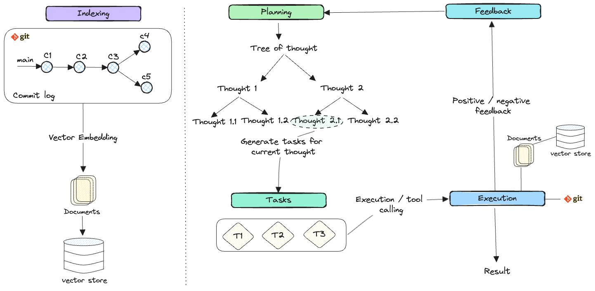

# git-agent

Git agent would answer various questions based on the log of commit messages and code diffs. Following are some of the examples:

Code Contribution Analysis: Who are the top contributors to this repository?

Bug Fix Identification: Which commits in the last week addressed reported bugs?

Feature Development Tracking: What features were added or removed in the last month?

Code Quality Metrics: What is the trend of code complexity over the last six months?

Release Note Generation: Generate release notes based on the commits since the last release.

Issue Closure Prediction: Based on past data, when is the estimated time for issue closure?

Code Ownership Identification: Who are the primary maintainers of this specific module or file?

Hotspot Analysis: Identify areas of the codebase that have been frequently modified recently.

Developer Activity Tracking: How active has each developer been in terms of commits and reviews over the past quarter?

## Architecture

For building agent workflow, planning, creating task, execution and feedback are crucial part of the architecture.

For long term memory, a vectorstore would be used.

## Installation

Download from http://example.com/FIXME.

## Usage

FIXME: explanation

    $ java -jar git-agent-0.1.0-standalone.jar [args]

## Options

FIXME: listing of options this app accepts.

## Examples

...

### Bugs

...

## TODO

1. Add github actions

## License

Copyright © 2024 FIXME

This program and the accompanying materials are made available under the
terms of the Eclipse Public License 2.0 which is available at
http://www.eclipse.org/legal/epl-2.0.

This Source Code may also be made available under the following Secondary
Licenses when the conditions for such availability set forth in the Eclipse
Public License, v. 2.0 are satisfied: GNU General Public License as published by
the Free Software Foundation, either version 2 of the License, or (at your
option) any later version, with the GNU Classpath Exception which is available
at https://www.gnu.org/software/classpath/license.html.
